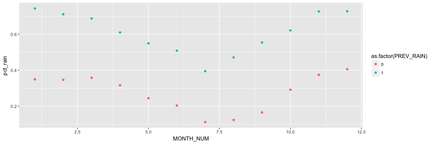

<style>
.reveal section p {
  font-size: 25px;
}
.reveal section ul {
  font-size: 25px;
}
.reveal pre code {
  font-size: 20px;
}
</style>

Chance of Rain
========================================================
author: Seth Dimick
date: April 7, 2018
autosize: true
font-family: 

Background
========================================================

<br>
In Seattle, rain is something you learn to live with. I am no weather expert, but for this course project I decided to build a few simplistic models for predicting rainy days in Seattle based on historic data. The "*Chance of Rain*" [Shiny](https://shiny.rstudio.com/) app is powered by 100 years (1918 to 2017) of weather data from the [National Centers for Environmental Information](https://www.ncdc.noaa.gov/cdo-web/) for the Portage Bay station in Seattle. The historic data is used to train a Logistic Regression model to predict the probability or rain as well as a GLM Classifier for rain versus no rain for a day given the month and whether or not on the previous day.

The Data
========================================================

The NOAA Data used for this project comes in the following format.


```r
head(rawData)
```

```
      STATION       DATE PRCP SNOW SNWD TMAX TMIN
1 USW00024281 1918-01-01 0.00    0    0   60   48
2 USW00024281 1918-01-02 0.00    0    0   52   44
3 USW00024281 1918-01-03 0.31    0    0   55   44
4 USW00024281 1918-01-04 0.14    0    0   53   47
5 USW00024281 1918-01-05 0.00    0    0   53   47
6 USW00024281 1918-01-06 0.59    0    0   55   47
```

The Inputs
========================================================

After some transformations, month and rain on the day before surfaced as interpretable, significant inputs for the app.


```r
rawData %>% 
    group_by(MONTH_NUM, PREV_RAIN) %>% 
    summarise(pct_rain = sum(RAIN)/n()) %>% 
    ggplot(aes(x = MONTH_NUM, y = pct_rain, color = as.factor(PREV_RAIN))) +
    geom_point()
```




Using the App
========================================================

##### User Input

- Select what month it is
- Select if it has rained today

##### Interpret Results

- Headline generated by GLM Classification model for rain versus no rain
- Probability of rain generated by Logistic Regression model
- A visual of the historic data is generated for tomorrow's precipitation status for the selected month and status of today's precipitation

### [Go to the App!](https://sdimick.shinyapps.io/rain-app/)

(*... and check out the code for the app and presentation [here](https://github.com/sdimick/coursera-shiny-app).*)
